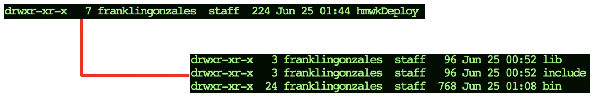
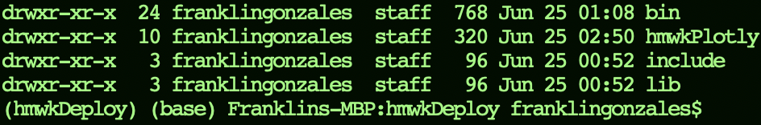
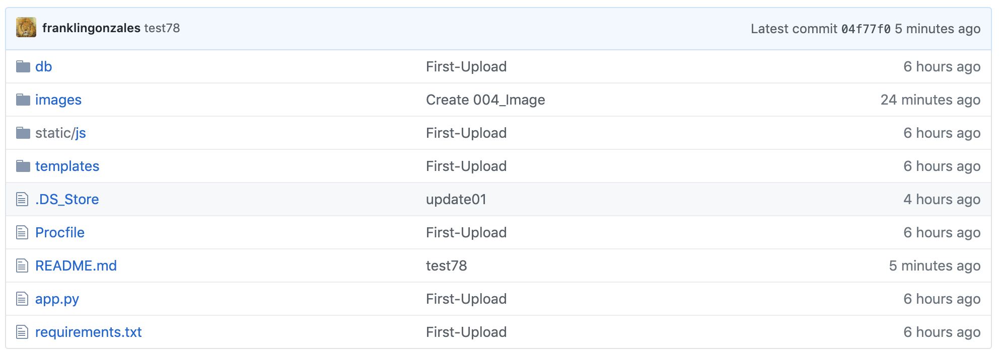
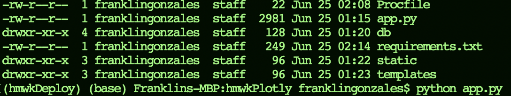
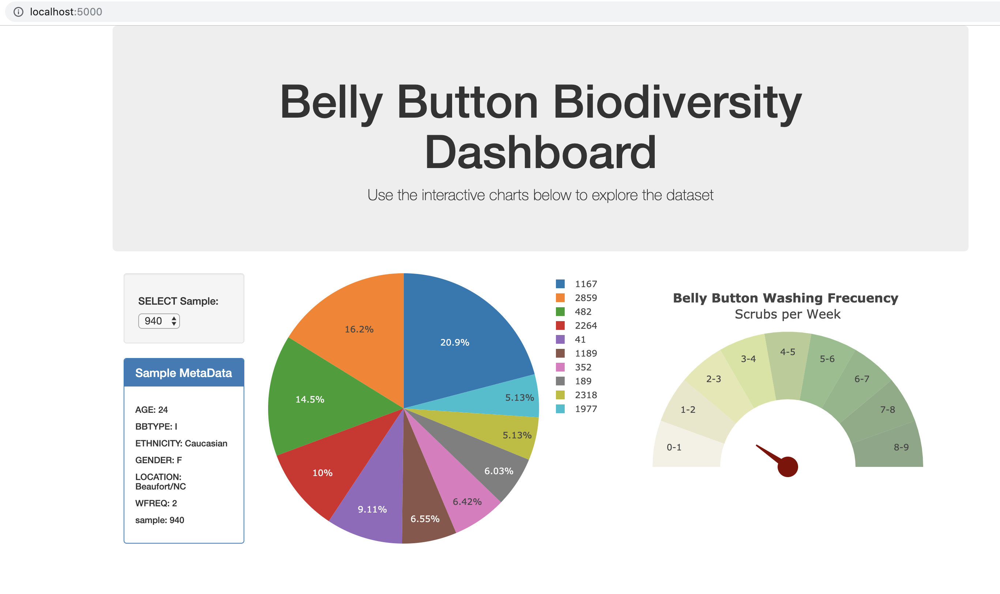
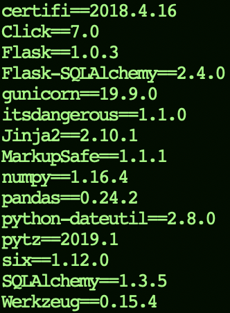
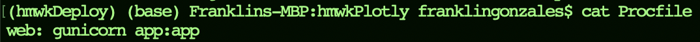
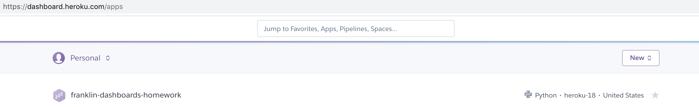
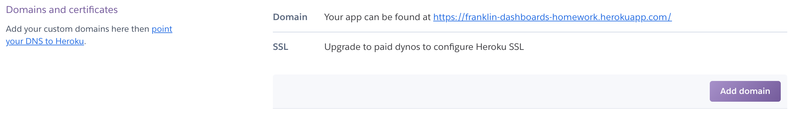
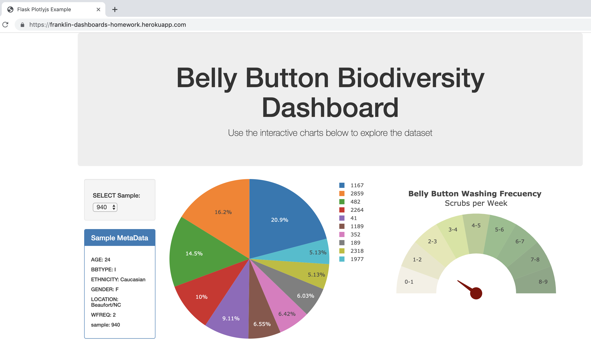

# Deploying a little Web-App in Heroku, with Flask - SQlite - JS
> by **Franklin Gonzales**, Georgia US, Jun 2019.
## Specifications
#### Computer Model: **MacBook, pro or air**
#### Operating system: **macOS, Mojave 10.14.5**
## Introduction

Next, I will deploy a Web application, created in Javascript, with queries to the SQLite database from python. In the part of the Back-end, we will have a Flask server. The application, in its entirety, will be transferred to Heroku to deploy on its servers. 
Let us begin!

## Road Map

We have the following 3 big steps:

* Create a virtual environment.
* Create the necessary files to perform deploy.
* Perform the deploy in Heroku.

## Instructions - step by step

#### 1. Create a virtual environment
* From a *terminal*, we created a new directory. For my case, I created the *deploy* directory.
```bash
$ mkdir deploy
$ ls -l
```


* We must create our own virtual work environment. For this, we will use the *virtualenv* application executed from our new directory. If we do not have the *virtualenv* application, we can install it with:
```bash
$ pip install virtualenv
```

* Now, we enter our new directory, and execute the command *virtualenv*. When executing the command *virtualenv* we must pass as an argument the name of our virtual environment. For my case, I have chosen the name: *hmwkDeploy*, but we can choose the name we want.
```bash
$ cd deploy
$ virtualenv hmwkDeploy
```


* Basically, when creating our development environment, we created a folder with the same name, which has 3 folders with what is necessary to build a small world of isolated development, within our operating system. Activate our new environment, from our *deploy* folder, with the following command that begin with a dot:

```bash
$ . hmwkDeploy/bin/activate
```


* As a next step, we installed *flask* server and *gunicorn*. The application [*gunicorn*](https://gunicorn.org/) will help us to deploy and execute the command of the execution of our app in heroku.

```bash
$ pip install flask
$ pip install gunicorn
```


#### 2. Create the necessary files to perform deploy
* We enter our folder, created by the hmwkDeploy environment:

```bash
$ cd hmwkDeploy
```

* Inside the *hmwkDeploy* folder, we will see a new folder with the name we want to give to our project. For my case, I chose *hmwkPlotly*

```bash
$ mkdir hmwkPlotly
```

If we execute the command **ls -l**, the *hmwkDeploy* folder should look like this:



* For this project, we will need a set of python libraries: *sqlite*, *sqlalchemy*, *Flask-sqlalchemy*, *numpy*, *pandas*. For this, we will execute the following commands within our environment:

```bash
$ pip install sqlite
$ pip install sqlalchemy
$ pip install flask-sqlalchemy
$ pip install numpy
$ pip install pandas
```

* This is my GitHub repository for this project.



* We copy the following project files, saved in this GitHub repository, to the *hmwkPlotly* folder:
  * *db* folder
  * *templates* folder
  * *static* folder
  * app.py
  * Procfile. This file must retain its name (The first letter is capitalized, and must not have any extension of the type .txt or .sh, etc).

* We execute the python command for the flask server saved in *app.py*



* Now, we open any browser like safari, chrome, or microsoft edge, and we call the address: **localhost:5000**



* As we already know that the application works correctly in our environment, we can generate the requirements.txt file. First, we stop the Flask server with the command **Control + C**, and execute the following command:

```bash
$ pip freeze > requirements.txt
```
* This is the content of the *requirements.txt* file, generated in my environment.



* All right; Now we need to check what is the content of our *Procfile* file. Basically, this file must contain the command that lets you know **Heroku**, which is the application that launches the server. For my case, it's the *app.py* file, but we'll only use the name of the file, without the *.py* extension:



#### 3. Perform the deploy in Heroku.

* First, you must have an account in Heroku. If you do not have it, it's time to create it by entering [I am new in Heroku](https://signup.heroku.com/).

* Login to your new Heroku account.

* So, now that you have created your account in Heroku, you need to download the client application, to execute the commands prior to deploy, from your terminal. Click on [Heroku CLI](https://devcenter.heroku.com/articles/heroku-cli) to download Heroku cliente app.

* Inside the folder kmwkPlotly and obviously within our environment hmwkDeploy, execute the following command, with the name of your project (for me it is *franklin-dashboards-homework*), from your terminal:

```bash
$ heroku create franklin-dashboards-homework
```

* Very well; even though we have already entered the Heroku platform with our user account on the web, we need to access our Heroku repository from our terminal; because we are going to execute some **git** commands, which will allow us to do **init**, **commit**; etc. Enter the following command to enter your Heroku repository but through the terminal:

```bash
$ heroku login
```

* As a next step, execute these commands:

```bash
$ git init
$ heroku git: remote -a franklin-dashboards-homework
```

* To **deploy your application**, write the following commands:

```bash
$ git add .
$ git commit -am "I am so excited!!!"
$ git push heroku master
```

* This is the screen on my desk in Heroku.




* In the settings section of your project, you can find the URL with which you can see your application from Heroku.




* Finally, our application seen from its own URL:




## Final specifications.

Whole folder is connected with my GitHub

Path in my local mac:
(/Users/franklingonzales/Documents/GeorgiaTech_DataScienceBOOTCAMP2019/PREWORK_FGC/Module-13 - Interactive Dashboards/FinalHomework/deploy/Heroku-Flask-JS-SQlite-Homework-wk15).

Github Path: [Github WebApp](https://github.com/franklingonzales/Heroku-Flask-JS-SQlite-Homework-wk15.git).
